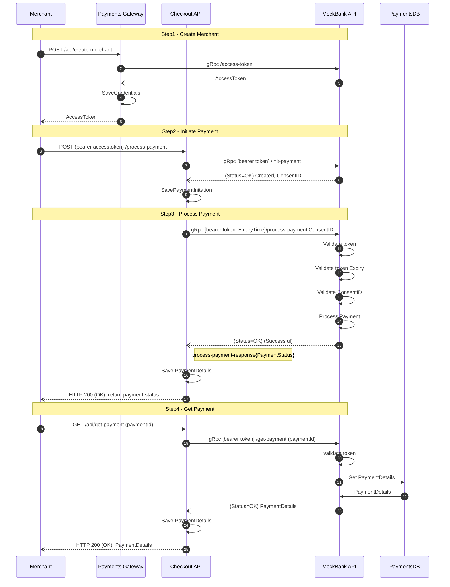

# Overview

The solution assumes, Merchants using Checkout API's Payment Gateway to process payments and eventually retrieve cleared settlements from the past dates. 

- API Spec : The API can be accessed using Swagger by running the application

- Authentication: Merchant registers with Checkout API's Payment Gateway using the clientID and clientKey and retrieves a bearer token / Access Token from Payment Gateway inorder to access the Payment Gateway API.

- TechStack: 
    - Payment Gateway / Checkout API: The gateway is built in ASP.NET core WebAPI with Restfull Services using OpenAPI specification.
    
    - Acquired Bank / MockBank API: The bank is built as a ASP.NET core grpc service
    
    - SQL Server: Checkout Merchant DB & PaymentsDB. Former works in the context of Checkout API and the latter works in the context of MockBank API
    
    - Docker: SQL Server DBs and MockBank and Payment Gateway can be containerised and run from docker enginer.

## Design

[link](https://1drv.ms/u/s!Ag7NKIWnRA_ugYwaTbRTM87OX9XfaA?e=iWhEc2)
    
## Workflow

Certain part of the design is inspired from [OpenBanking API Spec](https://openbankinguk.github.io/read-write-api-site3/v3.1.10/references/usage-examples/domestic-payments-usage-examples.html#sequence-diagram)

## Deliverables

- Checkout API aka Payment Gateway: A Restfull Service with OpenAPI specifiction that can be accessed using Swagger

- MockBank API: A grpc Service that emulates the behavior of bank and helps processing the payments from Checkout API

- CheckoutMerchantDB: Merchant Details (works in the context of Checkout API)

- PaymentsDB: Payment Details 

## TestSetup

Components used
1. AutoFixture
2. Moq
3. XUnit
4. Fluent Assertions

> I wish there is a better code coverage for this, but couldn't achieve it due to time crunch. 
    
> Validators are added at the edge points to validate the input parameters and throw any validation errors if not meeting the requirements

## Environment

1. Pull the latest sql server docker image using the following command

        docker pull mcr.microsoft.com/mssql/server

2. Run CheckoutMerchant API, MockBank API and SQL Server in a docker network using docker compose

        docker compose up

3. Open Visual Studio and open the following SQL file from the DACPAC folder in the solution and run each SQL file (CheckoutMerchantDB.sql, PaymentsDB.sql) individually...
        
    3.1. Login - Server: localhost, User ID: sa, Password: password_123

4. Run the swagger file to load CheckoutMerchant.API

    4.1. https://localhost:61673/swagger/index.html

5. [Download BloomRPC](https://github.com/bloomrpc/bloomrpc/releases) and run the tool for running MockBank API as a client

    [BloomRPC](https://1drv.ms/u/s!Ag7NKIWnRA_ugYwcAshhwwwNQ-QlSQ?e=2meELe)
    
    5.1. Import the proto file from the solution folder 
            
        path: /MockBank.API/Protos/greet.proto

    [Proto file](https://1drv.ms/u/s!Ag7NKIWnRA_ugYwdenZQH6tormvC8A?e=uf91RN)
    
    5.2. Once the proto contracts loaded, in the Env field, enter the following address:    `localhost:61672`

    [Service Address](https://1drv.ms/u/s!Ag7NKIWnRA_ugYwek36Vyk9wur7gXA?e=fnHiDT)

    5.3. Test GenerateAccessToken grpc call to verify if the service is reachable

    
> Note: The idea is to inject SQLPackage.exe after docker-compose up is run so as to create the required Database and tables in the docker container of SQLServer. However, with the limited timeframe, I refrained from using it.  

## Design Improvements

[Design Improvements](https://1drv.ms/u/s!Ag7NKIWnRA_ugYwbqMx8xsbXsNFIxg?e=QQw72k)

## Code Quality Improvements

. Warnings should have been addressed

. More improvements to the workflow like CQRS pattern to encapsulate a series of commands to make the code more scalable

. Improving exception handling by efficient usage of Middleware in CheckoutMerchant.API and interceptors in MockBank.API, and also use the same for validations.

. Resilience techniques like Retry with exponential backoff logic